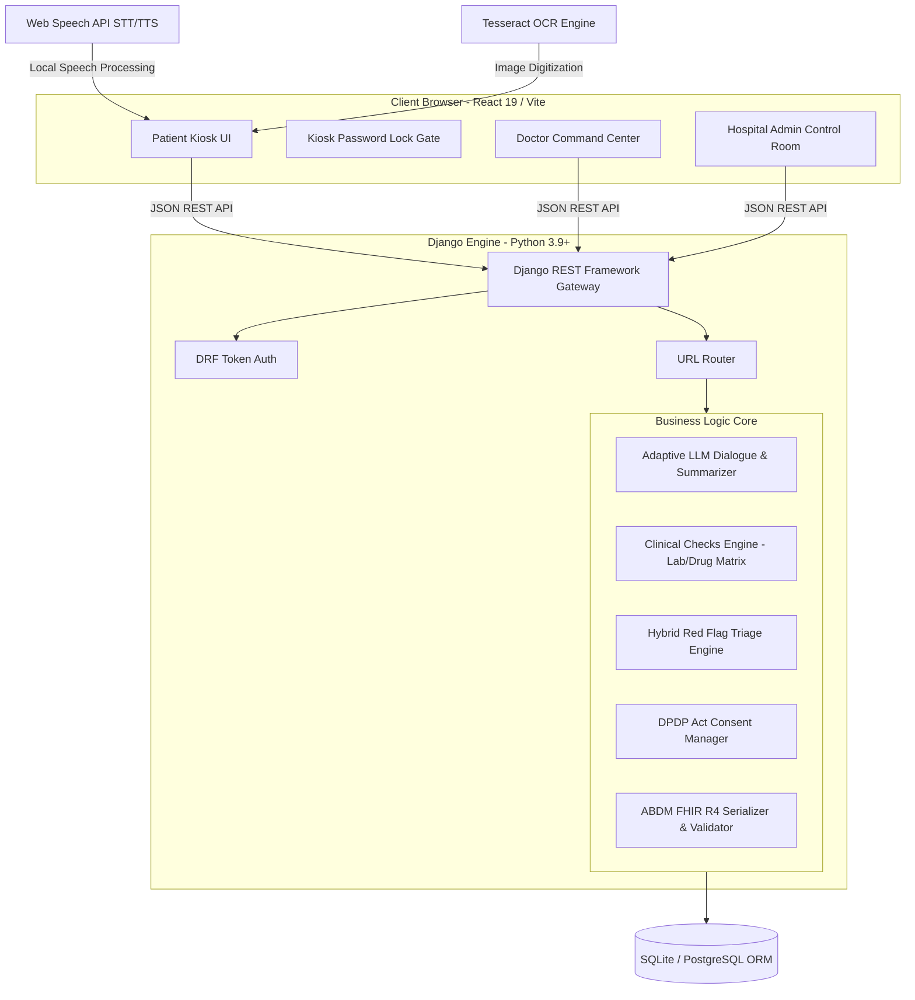

# 🏥 Sahayak — Pre-Consultation OPD Intake & Clinical Intelligence Platform

> **An advanced, hardware-agnostic clinical pre-consultation engine featuring multilingual voice intake (English, Hindi, Marathi, Tamil, Telugu, Bengali, Kannada), granular AYUSH constitutional mapping, multi-select question processing, client-side safety locking, OCR paper digitization, source-linked anti-hallucination summaries, and ABDM FHIR R4 exchange.**

---

## 📌 Executive Overview

In Indian public and government hospitals, outpatient departments (OPDs) handle **4,000–10,000 patients daily**. Doctors get only **2–5 minutes per patient** — among the shortest consultation times in the world (*BMJ Open, 2017*). In that tiny window, doctors must take a clinical history, examine the patient, review old paper prescriptions/reports, diagnose, and prescribe. History-taking, which traditionally solves 70–80% of diagnoses, gets severely abbreviated or skipped.

Furthermore, **AYUSH (Ayurvedic) OPDs** require an even deeper constitutional and lifestyle assessment (*Dashavidha Pariksha*: Prakriti, Vikriti, Agni, Koshtha, Ahara-Vihara) that is virtually impossible to capture manually within 3 minutes.

**Sahayak** addresses this bottleneck by shifting the history-taking and document ingestion process to a secure, patient-facing kiosk. Through adaptive voice dialogue, the platform compiles clinical symptoms, digitizes paper documents, flags safety concerns, structures a source-linked intake summary, and serializes the outcome into standardized ABDM-compliant FHIR R4 records.

---

## 🎯 Impact & Key Benefits

| Stakeholder | Challenges Faced | Sahayak Solution & Impact |
| :--- | :--- | :--- |
| **Doctors (Allopathic & AYUSH)** | 2–5 min per patient; rushed history-taking; burnout; sifting through paper clutter | **Saves 60–70% of consultation time.** Presents a structured, editable clinical summary with every fact traceable back to transcript lines (*source-linking*). |
| **Patients** | Elderly, rural, low-literacy; feel rushed; must repeat history every visit | **Zero-training, walk-up voice + touch interface** in native regional languages. Captures complete history without smartphone app friction. |
| **AYUSH Practitioners** | Abbreviating Ayurvedic constitutional history due to OPD time limits | **First-class AYUSH Mode** capturing full *Dashavidha Pariksha* (Prakriti, Agni, Koshtha, Ahara-Vihara) alongside standard intake. |
| **Hospital Admins & Ecosystem** | Fragmented paper records; failing ABDM digitization targets | **Instant ABDM FHIR R4 digitization.** Pushes standardized FHIR bundles to ABHA records automatically. |

---

## 🔄 System Workflow & Data Pipeline

```
[ Patient Voice/Touch Input ] OR [ Upload Prescription/Lab Report ]
            │                                     │
            ▼ (Client-Side Audio)                 ▼ (Client-Side Image)
┌────────────────────────────────┐       ┌────────────────────────────────┐
│   Web Speech API (STT Engine)  │       │     Local Canvas Preview       │
└────────────────┬───────────────┘       └────────────────┬───────────────┘
                 │                                        │
                 ▼ (Text Stream / Answer)                 ▼ (Multipart Form Image Upload)
┌─────────────────────────────────────────────────────────────────────────┐
│                      Vite / React 19 Frontend Client                    │
└────────────────────────────────┬────────────────────────────────────────┘
                                 │
                                 │ REST HTTP Request (Bearer/Token Auth)
                                 ▼
┌─────────────────────────────────────────────────────────────────────────┐
│                      Django REST Framework Backend                      │
└────────────────────────────────┬────────────────────────────────────────┘
                                 │
        ┌────────────────────────┼────────────────────────┐
        ▼ (Dialogue Flow)        ▼ (OCR Document Flow)    ▼ (Triage/Tally)
┌───────────────┐        ┌───────────────┐        ┌───────────────┐
│ services/     │        │ services/     │        │ services/     │
│ llm.py        │        │ ocr.py        │        │ redflag_      │
│               │        │ (Tesseract)   │        │ rules.py      │
└───────┬───────┘        └───────┬───────┘        └───────┬───────┘
        │                        │                        │
        ▼ (Granular Questions)   ▼ (Extracted Data)       ▼ (Active Alerts)
┌───────────────┐        ┌───────────────┐                │
│ Patient UI    │        │ services/     │                │
│ Option Chips  │        │ clinical_     │                │
└───────────────┘        │ checks.py     │                │
                         │ (Lab Ranges & │                │
                         │  Drug Matrix) │                │
                         └───────┬───────┘                │
                                 │                        │
                                 ▼ (Clinical Warnings)    ▼
┌─────────────────────────────────────────────────────────────────────────┐
│                         Database (SQLite/Postgres)                      │
│      Stores: Session, Transcript, Document, Summary, ClinicalFlag       │
└────────────────────────────────┬────────────────────────────────────────┘
                                 │
        ┌────────────────────────┴────────────────────────┐
        ▼ (Doctor Review)                                 ▼ (Operational Overview)
┌────────────────────────────────┐       ┌────────────────────────────────┐
│     Doctor Command Center      │       │  Hospital Admin Control Room   │
│  - Reviews structured HPI      │       │  - Real-time queue telemetry   │
│  - Inspects clinical alerts    │       │  - Complaint analytics breakdown│
│  - Edits & verifies summary    │       │  - Red flag alert monitoring   │
└────────────────┬───────────────┘       └────────────────────────────────┘
                 │
                 ▼ (Verified Composition)
┌────────────────────────────────┐
│       services/abdm.py         │
│  - Builds FHIR R4 Bundle       │
│  - Validates Composition       │
└────────────────┬───────────────┘
                 │
                 ▼ (Push Composition)
      [ ABDM HIE Network / ABHA ]
```

---

## 🏗 System Architecture Block Diagram



---

## 🛠 Technology Stack & Design Decisions

### **1. Frontend Client**
* **Framework**: **React 19 & Vite**
  * *Why?* Rapid hot module reloading (HMR) and ultra-low runtime footprint necessary for local kiosk browser rendering. React 19 provides efficient concurrent rendering for instant responsive UI changes.
* **UI & Styling System**: **Vanilla CSS (HSL Token-based)**
  * *Why?* Guarantees maximum browser layout flexibility, custom responsive grid designs, and custom theme tokens (high-contrast support) without the compile-time overhead of TailwindCSS or UI frameworks.
* **Speech Processing**: **Web Speech API (`webkitSpeechRecognition` & `SpeechSynthesis`)**
  * *Why?* Performs client-side Speech-to-Text and Text-to-Speech directly in the user's browser (Chrome, Edge). This avoids expensive audio streaming network overhead and cloud STT API subscription costs.
* **Iconography**: **Lucide React**

### **2. Backend Engine**
* **Core Framework**: **Python 3.9+ & Django 4.2 (Django REST Framework)**
  * *Why?* Django provides a mature, secure ORM and production-grade security defaults. DRF provides robust serialization, status-code conventions, and token-based gateway authentication.
* **Database**: **SQLite** (Development) / **PostgreSQL** (Production ready via settings.py).
* **Document Ingestion**: **Pytesseract (Tesseract OCR Engine) & Pillow (PIL)**
  * *Why?* Provides high-accuracy offline character recognition. Customized regex and location heuristics extract doctor names, dates, and prescription medicines.

### **3. AI & Interoperability**
* **AI Orchestration**: **Meta Llama-3.1-8B-Instruct** (via Hugging Face API / local vLLM).
  * *Why?* Supports complex system prompt instructions in multiple regional languages and outputs structured JSON schemas deterministically.
* **Interoperability Standards**: **ABDM FHIR R4 Bundle Specification**
  * *Why?* Adheres to the National Digital Health Mission (NDHM) schema guidelines for generating interoperable electronic health records.

---

## 🔑 Key Technical Modules & Implementation Details

### 1. Dual-Track Adaptive Dialogue Engine (`backend/core/services/llm.py`)
* **Allopathic Mode**: Tracks the clinical **SOCRATES** ontology:
  * **S**ite (Where is the pain?)
  * **O**nset (When did it start?)
  * **C**haracter (What does it feel like?)
  * **R**adiation (Does it move anywhere?)
  * **A**ssociated Symptoms (Any other issues?)
  * **T**iming (Is it constant or intermittent?)
  * **E**xacerbating/Relieving factors (What makes it better/worse?)
  * **S**everity (Rate from 1 to 10)
* **AYUSH Mode**: Tracks Ayurvedic **Dashavidha Pariksha** elements:
  * **Prakriti** (Constitutional body type)
  * **Agni** (Digestive fire strength)
  * **Koshtha** (Bowel habits)
  * **Ahara & Vihara** (Diet, sleep cycles, and daily routines)
* **Deterministic Dimension Tracker**: The conversation is structured statefully. Rather than letting the LLM hallucinate or lose track, a per-session list of covered dimensions is tracked. The backend calculates `unasked_dimensions` and forces the LLM to choose exactly one unasked dimension for the next turn.

### 2. Multi-Select Dialogue Processing
* Implemented dynamic interface switching. When the current conversation dimension matches multi-answer fields (e.g., `associated_symptoms`), the engine injects a `"selection_mode": "multi"` instruction.
* The frontend React client renders toggleable chips with active states and a consolidated **"Done"** submission action, which joins selected options into a single string.

### 3. Client-Side Security & Kiosk Lock Gate (`frontend/src/App.jsx`)
* **Hardware Simulation**: To secure physical public tablet deployments, clicking "Patient Portal" locks the interface.
* **Passcode Protection**: Transitioning into or out of kiosk mode is gated by a security passcode screen (Demo: `1234`).
* **State Persistence**: The active view state is saved to `localStorage`. If a patient restarts or refreshes the page, the browser remains locked inside the Patient Kiosk, preventing access to Doctor and Admin views.

### 4. Anti-Hallucination Source-Linking (`frontend/src/components/DoctorCommandCenter.jsx`)
* Hallucinations in medical AI summaries can lead to dangerous clinical outcomes. 
* **Fact Traceability**: The summarizer generates mapping references (`source_turns` and `source_documents`).
* **Visual Verification**: When the doctor views the structured chart in the Doctor Command Center, clicking or hovering over any summary block dynamically highlights and auto-scrolls to the exact transcript dialogue or OCR document sentence that generated the information.

### 5. Clinical Safety Engine (`backend/core/services/clinical_checks.py`)
* Runs automated assessments during intake:
  * **Lab Reference Ranges**: Compares extracted metrics (Hemoglobin, HbA1c, Blood Sugar, Serum Creatinine, Blood Pressure) against clinical safety envelopes and flags abnormalities.
  * **Drug-Drug Interaction Checker**: Evaluates extracted medications against a drug interaction matrix (e.g., *Warfarin + Aspirin* triggering warning alerts).

### 6. DPDP Act 2023 Consent Manager (`backend/core/models.py` & `views.py`)
* Complies with India's Digital Personal Data Protection Act:
  * Records granular consent scopes (`intake_interview`, `ocr_scanning`, `abdm_sharing`).
  * Provides instantaneous revocation endpoints (`/api/consent/revoke/`) that immediately anonymize session data.

### 7. Hospital Admin Control Room (`backend/core/admin_views.py`)
* Provides an operational, aggregate overview of the clinical pre-consultation flow.
* **Queue Triage Engine**: Orders patients dynamically, prioritizing emergency red flags and longest waiting times.
* **Aggregated Metrics**: Pre-computes analytics (complaint breakdowns, language preferences, OCR confidence averages, token validation rates) on the fly without adding heavy tracking models.

---

## 📊 Database Model Diagram

```
┌────────────────────────┐         ┌────────────────────────┐
│        Patient         │         │        Session         │
├────────────────────────┤         ├────────────────────────┤
│ id (PK)                │         │ id (PK)                │
│ name                   │◄────────┤ patient_id (FK)        │
│ language               │         │ status                 │
│ preferred_language     │         │ mode (ayush/allopath)  │
│ abha_id / abha_number  │         │ red_flag (Bool)        │
└────────────────────────┘         │ red_flag_reason        │
                                   │ token                  │
┌────────────────────────┐         │ token_status           │
│       Transcript       │         │ needed_clarification   │
├────────────────────────┤         └───────────┬────────────┘
│ id (PK)                │                     │
│ session_id (FK)        │◄────────────────────┤
│ turn (Int)             │                     │
│ speaker (ai/patient)   │                     ▼
│ text                   │         ┌────────────────────────┐
│ dimension_asked        │         │        Document        │
└────────────────────────┘         ├────────────────────────┤
                                   │ id (PK)                │
┌────────────────────────┐         │ session_id (FK)        │◄──┐
│        Summary         │         │ confidence             │   │
├────────────────────────┤         │ extracted_text         │   │
│ id (PK)                │         └────────────────────────┘   │
│ session_id (FK) (1to1) │◄──┐                                  │
│ structured_json        │   │     ┌────────────────────────┐   │
│ doctor_notes           │   │     │      ClinicalFlag      │   │
└────────────────────────┘   │     ├────────────────────────┤   │
                             └───  │ id (PK)                │   │
                                   │ session_id (FK)        │   │
                                   │ document_id (FK)       │◄──┘
                                   │ flag_type              │
                                   │ detail (JSON)          │
                                   └────────────────────────┘
```

---

## 📶 API Endpoint Reference

### **General / Patient Flow**
* `POST /api/interview/start/`: Initializes a pre-consultation session and retrieves the first question.
* `POST /api/interview/respond/`: Submits the patient response and returns the next question or completion state.
* `POST /api/documents/upload/`: Ingests previous prescriptions or lab reports for character extraction and validation.
* `POST /api/summary/generate/`: Instructs the backend to assemble the structured, source-linked clinical summary.
* `GET /api/summary/<int:session_id>/`: Retrieves full transcripts, documents, summaries, and consent logs (Token authenticated).
* `POST /api/consent/grant/`: Creates a consent audit log.
* `POST /api/consent/revoke/`: Revokes authorization and locks down session data.
* `POST /api/auth/login/`: Auths staff users (Doctors, Admins) and returns a session Token.

### **Hospital Admin Portal**
* `GET /api/admin/queue/`: Returns the live, prioritized dashboard queue and patient counts (Token authenticated).
* `GET /api/admin/alerts/`: Returns a real-time list of red-flagged clinical alerts (Token authenticated).
* `GET /api/admin/analytics/`: Computes and aggregates operational metrics (Token authenticated).

---

## 📊 Feasibility & Viability Analysis

### 1. Technical Feasibility
- **Hardware-Agnostic**: Operates on any touchscreen tablet, laptop, or dedicated kiosk hardware via standard web browsers.
- **Client-Side Speech Processing**: Offloads speech-to-text to browser native Web Speech API, reducing server infrastructure load and eliminating audio streaming bandwidth bottlenecks.
- **Resilient Fallback Design**: Features deterministic SOCRATES question rotation and keyword safety checks that guarantee continuous intake operation even during LLM API latency or outage events.

### 2. Economic & Financial Viability
- **Low Cost per Intake**: Standardized API execution costs less than **₹0.50 ($0.006) per patient intake**, compared to ₹50–100 per patient for human nurse-led intake desks.
- **Open-Source Compatibility**: Compatible with locally hosted open-source models (e.g., Llama-3.1-8B via Ollama / vLLM) for zero-recurring-cost offline hospital deployments.

### 3. Operational Viability in Indian OPDs
- **Zero Patient Onboarding**: Patients walk up, tap language, and speak. No app downloads, no password registration.
- **Multilingual Support**: Supports English, Hindi, Tamil, Telugu, Kannada, Bengali, Marathi out of the box.

### 4. Regulatory & Data Governance Compliance
- **DPDP Act 2023**: Granular consent architecture with audit logging.
- **ABDM Compliance**: Directly maps to India's National Health Stack FHIR R4 standards.

---

## ⚡ Setup & Deployment Guide

### **System Prerequisites**
- **Python**: 3.9+
- **Node.js**: 18+
- **Tesseract OCR Engine**:
  - *macOS*: `brew install tesseract`
  - *Ubuntu/Debian*: `sudo apt-get install tesseract-ocr`

### **1. Backend API Server**
```bash
cd backend

# Initialize environment
python3 -m venv .venv
source .venv/bin/activate

# Install dependencies
pip install -r requirements.txt

# Run migrations
python manage.py migrate

# Seed dummy operational data for Doctor and Admin views
python manage.py seed_demo_data

# Run dev server
python manage.py runserver 8000
```

### **2. Frontend Dashboard Client**
```bash
cd frontend

# Install package dependencies
npm install

# Start Vite client
npm run dev
```

### **3. Accessing the Platform**
* **Public Kiosk Landing Page**: `http://localhost:5173`
* **Default Doctor Login**: Username `doctor` / Password `password123`
* **Default Admin Login**: Username `admin` / Password `admin123`
* **Default Kiosk Mode Passcode**: `1234`

---

## 📜 Repository Structure

```
.
├── backend/
│   ├── core/
│   │   ├── models.py             # Patient, Session, Transcript, Document, ClinicalFlag, Summary, ConsentRecord, ABDMPushLog
│   │   ├── serializers.py        # DRF JSON serializers & validation rules
│   │   ├── views.py              # REST API ViewControllers
│   │   ├── urls.py               # API route definitions
│   │   └── services/
│   │       ├── llm.py            # Hugging Face Llama-3.1 dialogue & summary engine
│   │       ├── ocr.py            # Tesseract OCR & handwriting layout detection
│   │       ├── redflag_rules.py  # Hard-coded keyword safety floor & LLM check
│   │       ├── clinical_checks.py# Lab reference range & drug interaction matrix
│   │       └── abdm.py           # FHIR R4 bundle builder & validator
│   ├── manage.py
│   └── requirements.txt
├── frontend/
│   ├── src/
│   │   ├── components/
│   │   │   ├── PatientKiosk.jsx        # Patient intake kiosk UI (Voice + Touch + OCR)
│   │   │   ├── DoctorCommandCenter.jsx # Doctor UI with source-linking & clinical flags
│   │   │   └── HospitalAdminPortal.jsx # Admin operational queue, stats, and alerts
│   │   ├── api.js                # Frontend API client
│   │   ├── App.jsx               # Navigation & mode routing
│   │   ├── index.css             # Glassmorphism CSS design system
│   │   └── main.jsx
│   ├── package.json
│   └── vite.config.js
└── README.md
```

---

## ⚖️ License & Acknowledgments

Built for the **Smart India Hackathon (SIH)**. Developed with Django REST Framework, React, Vite, and Tesseract OCR.
